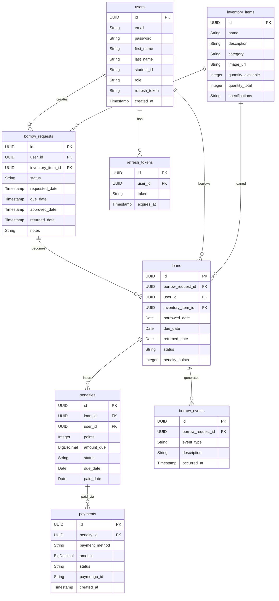
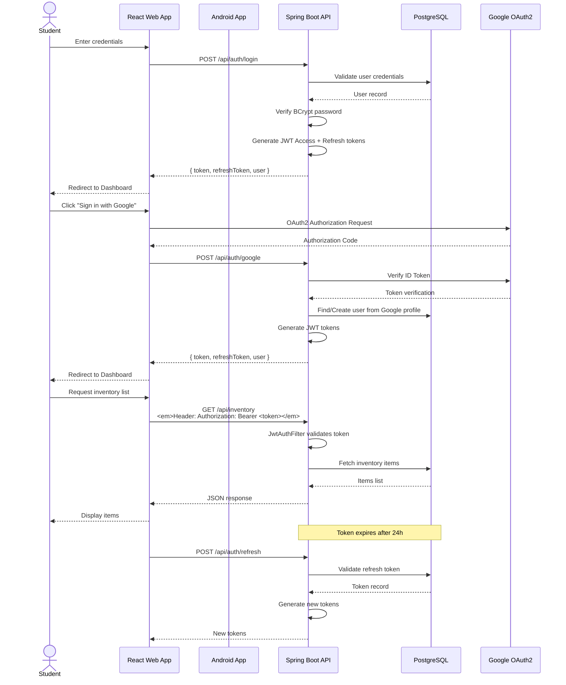
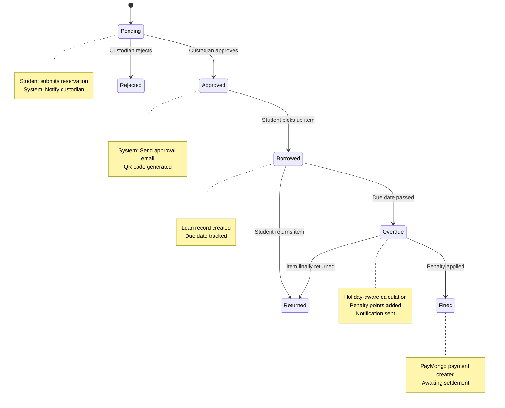
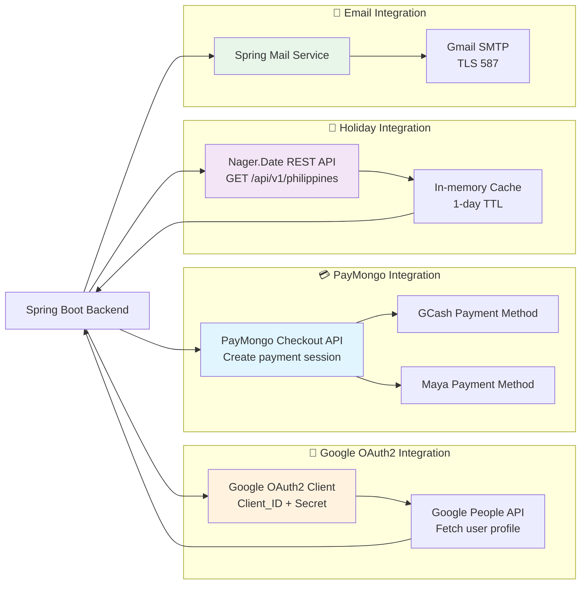
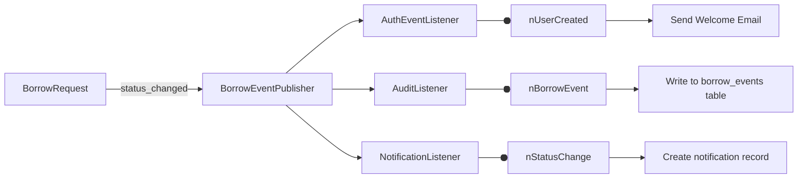

# TechLoan - System Architecture Diagram

## 1. System Overview

```mermaid
graph TB
    %% External Actors
    subgraph Actors["👥 Actors"]
        Student[Student<br/>👤 CIT-U Student]
        Custodian[Custodian<br/>👤 Lab Staff]
        External[External Systems<br/>🔗 Third-Party APIs]
    end

    %% Client Layer
    subgraph Client["🌐 Client Layer"]
        Web[React Web App<br/>📱 Browser-based - React 18 + Vite + Tailwind]
        Mobile[Android Mobile App<br/>📲 Kotlin + MVVM + Retrofit]
    end

    %% API Gateway / Security Layer
    subgraph Security["🔐 Security & API Gateway"]
        JWT[JWT Authentication<br/>🪙 Access (24h) + Refresh (7d) Tokens]
        RBAC[Role-Based Access Control<br/>👑 STUDENT / CUSTODIAN Roles]
        OAuth2[Google OAuth2<br/>🔑 Social Login Integration]
        CSRF[CSRF Protection<br/>🛡️ Cross-Site Request Forgery]
    end

    %% Application Layer - Feature Modules
    subgraph Features["⚙️ Application Layer - Feature Modules"]
        Auth[Auth Module<br/>👤 Registration, Login, Profile]
        Inventory[Inventory Module<br/>📦 Equipment Management]
        Reservation[Reservation Module<br/>📋 Borrow Request Workflow]
        Loan[Loan Module<br/>🔄 Active Loan Tracking]
        Penalty[Penalty Module<br/>⚠️ Overdue Penalty Calculation]
        Payment[Payment Module<br/>💳 PayMongo GCash/Maya]
        Notification[Notification Module<br/>📧 Email + In-App Alerts]
        Holiday[Holiday Module<br/>📅 Nager.Date Integration]
    end

    %% Shared Components
    subgraph Shared["🛠️ Shared Components"]
        Validation[Validation Pipeline<br/>✔️ Chain of Responsibility]
        DTOFactory[DTO Factory<br/>🏭 Object Mapping]
        Events[Event Publisher/Observer<br/>📡 Audit & Notifications]
        ErrorHandler[Global Exception Handler<br/>❌ ApiErrorResponse]
    end

    %% Data Access Layer
    subgraph Repository["💾 Data Access Layer"]
        JPA[JPA Repositories<br/>📚 Spring Data JPA]
    end

    %% Database
    subgraph Database["🗄️ Database Layer"]
        DB[(PostgreSQL<br/>🐘 Supabase Hosted<br/>aws-ap-southeast-2)]
    end

    %% External Integrations
    subgraph ExternalServices["🌍 External Services"]
        Google[Google OAuth2<br/>🔐 Identity Provider]
        PayMongo[PayMongo Gateway<br/>💳 GCash / Maya Payments]
        SMTP[Gmail SMTP<br/>📨 Welcome & Notification Emails]
        NagerDate[Nager.Date API<br/>📆 PH Public Holidays]
    end

    %% Flow: Actors → Clients
    Student --> Web
    Student --> Mobile
    Custodian --> Web
    Custodian --> Mobile

    %% Flow: Clients → Security
    Web --> JWT
    Mobile --> JWT
    JWT --> RBAC
    Web --> OAuth2
    Mobile --> OAuth2

    %% Flow: Security → Features
    JWT --> Auth
    JWT --> Inventory
    JWT --> Reservation
    JWT --> Loan
    JWT --> Penalty
    JWT --> Payment
    JWT --> Notification
    JWT --> Holiday

    %% Feature Module Interactions
    Auth --> Validation
    Reservation --> Validation
    Inventory --> Validation

    %% Feature → Shared
    Auth --> DTOFactory
    Reservation --> DTOFactory
    Notification --> DTOFactory

    Reservation --> Events
    Auth --> Events

    %% Feature → Repository
    Auth --> JPA
    Inventory --> JPA
    Reservation --> JPA
    Loan --> JPA
    Penalty --> JPA
    Payment --> JPA
    Notification --> JPA
    Holiday --> JPA

    %% Repository → Database
    JPA --> DB

    %% External Service Integrations
    OAuth2 --> Google
    Payment --> PayMongo
    Notification --> SMTP
    Holiday --> NagerDate

    %% Notification Service Interactions
    Auth -.-> Notification
    Reservation -.-> Notification
    Loan -.-> Notification

    %% Penalty Calculation depends on Loan & Holiday
    Loan --> Penalty
    Holiday --> Penalty

    %% Reservation workflow
    Reservation --> Loan
    Inventory --> Reservation
    Inventory --> Reservation

    style DB fill:#e1f5ff
    style External fill:#fff3e0
    style Security fill:#f3e5f5
    style Shared fill:#e8f5e9
```

---

## 2. Component Details

### 2.1 Actors & User Roles

| Actor | Description | Capabilities |
|-------|-------------|--------------|
| **Student** | CIT-U students borrowing lab equipment | Register, browse inventory, submit borrow requests, view loans, pay penalties |
| **Custodian** | Laboratory staff managing equipment | Approve/reject reservations, manage inventory, scan QR codes, track loans |

### 2.2 Feature Modules (Vertical Slice Architecture)

Each feature module in `backend/src/main/java/edu/cit/rentuma/techloan/features/` contains:

```
feature/
├── controller/    # REST API endpoints
├── service/       # Business logic
├── repository/    # Data access (JPA)
├── model/         # Entity classes
├── dto/           # Data Transfer Objects
├── validator/     # Validation rules (Chain of Responsibility)
└── observer/      # Event listeners (Observer pattern)
```

### 2.3 Database Schema



---

## 3. Security & Authentication Flow



---

## 4. Reservation (Borrow) Workflow



---

## 5. Technology Stack & Design Patterns

### 5.1 Full Technology Stack

| Layer | Technology |
|-------|-----------|
| **Backend Framework** | Spring Boot 3.3.5 |
| **Language** | Java 21 (Eclipse Temurin) |
| **Build Tool** | Maven 3.9+ |
| **Security** | Spring Security + JWT + BCrypt + OAuth2 |
| **ORM** | JPA + Hibernate |
| **Database** | PostgreSQL (Supabase cloud) |
| **Web Client** | React 18, Vite, Tailwind CSS |
| **Mobile** | Android (Kotlin), MVVM pattern |
| **API Integration** | Retrofit (Mobile), Axios (Web) |
| **Payment** | PayMongo API (GCash, Maya) |
| **Email** | Spring Mail + Gmail SMTP |
| **External API** | Nager.Date (Philippine Holidays) |
| **Testing** | JUnit 5, Mockito, Spring Test, RestAssured |
| **Code Coverage** | JaCoCo (92%+ coverage) |

### 5.2 Design Patterns Implemented

| Pattern | Location | Purpose |
|---------|----------|---------|
| **Facade** | `AuthFacade.java` | Unifies register/login/OAuth into single interface |
| **Factory** | `DTOFactory.java` | Centralizes conversion between Models ↔ DTOs |
| **Builder** | `User.UserBuilder` | Fluent construction of User objects |
| **Observer** | `BorrowEventPublisher` + `AuditListener` | Event-driven audit logging |
| **Chain of Responsibility** | `ItemNameValidator` → `DueDateValidator` → `DescriptionValidator` | Validation pipeline |
| **Strategy** | `StandardRegistrationValidator`, `GoogleRegistrationValidator` | Swappable validation rules |

---

## 6. External Service Integration Map



---

## 7. Deployment Architecture

```mermaid
graph TB
    subgraph Cloud["Cloud Infrastructure ☁️"]
        direction TB
        subgraph Supabase["Supabase Platform"]
            DB[(PostgreSQL Database<br/>Region: Asia Pacific<br/>aws-ap-southeast-2<br/>Connection Pooled)
        end

        subgraph Storage["Storage Services"]
            ImageStorage[Supabase Storage<br/>Equipment Images<br/>uploads/equipment/]
        end
    end

    subgraph BackendServer["Backend Server 🖥️"]
        direction TB
        App[Spring Boot Application<br/>Port: 8080]
        App --> DB
        App --> ImageStorage
    end

    subgraph Frontend["Frontend Hosting 🌐"]
        WebHost[Static Web Host<br/>React Build Files<br/>Vite dist/]
    end

    subgraph Mobile["Mobile Distribution 📱"]
        APK[APK / Play Store<br/>Android Application])
    end

    Client[Users: Student/Custodian<br/>🏫 CIT-U Network] --> Frontend
    Client --> Mobile
    Frontend --> App
    App --> Supabase

    Client -.->|HTTPS/REST| App
    App -.->|JWT Tokens| Client
```

---

## 8. Data Flow Summary

| Flow | Source → Target | Description |
|------|----------------|-------------|
| **Student Registration** | Student → Backend → DB | Email/Google auth, creates user with role |
| **Browse Inventory** | Student → Backend → DB | GET inventory items, returns DTO list |
| **Submit Reservation** | Student → Backend → DB | Creates borrow_request with PENDING status |
| **Custodian Approval** | Custodian → Backend → DB | Updates borrow_request status → creates loan |
| **Borrow Transaction** | Backend ↔ Loan ↔ Inventory | Decrements available_quantity, records loan |
| **Return Processing** | Custodian → Backend → DB | Updates loan status → increments quantity |
| **Penalty Calculation** | Backend (Cron) → Loan → DB | Daily job checks overdue loans, applies penalties |
| **Payment Initiation** | Student → Backend → PayMongo | Creates checkout session, returns payment URL |
| **Payment Webhook** | PayMongo → Backend → DB | Updates payment status → clears penalties |
| **Notification** | Backend → Email Service | Sends alerts via Gmail SMTP |

---

## 9. API Endpoints Map

```
Base URL: http://localhost:8080/api

📁 Authentication (AuthController)
POST   /auth/register          - Student registration
POST   /auth/login             - Login with credentials
POST   /auth/refresh           - Refresh JWT token
POST   /auth/google            - Google OAuth2 login
GET    /auth/profile           - Get current user
PUT    /auth/profile           - Update profile

📁 Inventory (InventoryController)
GET    /inventory              - List all inventory items
GET    /inventory/{id}         - Get item details
POST   /inventory              - Create new item (Custodian)
PUT    /inventory/{id}         - Update item (Custodian)
DELETE /inventory/{id}         - Delete item (Custodian)
POST   /inventory/{id}/image   - Upload image (Custodian)

📁 Borrow/Reservation (BorrowController)
POST   /borrow/request         - Submit borrow request
GET    /borrow/requests        - List my requests (Student)
GET    /borrow/requests/all    - List all requests (Custodian)
PUT    /borrow/request/{id}/approve  - Approve (Custodian)
PUT    /borrow/request/{id}/reject   - Reject (Custodian)
PUT    /borrow/request/{id}/return   - Mark returned (Custodian)

📁 Loans (LoanController)
GET    /loans/my-loans          - My active loans (Student)
GET    /loans/all               - All active loans (Custodian)

📁 Penalties (PenaltyController)
GET    /penalty/my-penalties    - My penalties (Student)
GET    /penalty/summary         - Penalty summary (Admin)

📁 Payments (PaymentController)
POST   /payment/initiate        - Create PayMongo payment
GET    /payment/success/{id}    - Payment success callback
GET    /payment/failed/{id}     - Payment failed callback
POST   /payment/webhook         - PayMongo webhook

📁 Notifications (NotificationController)
GET    /notifications           - Get my notifications
PUT    /notifications/{id}/read - Mark as read

📁 Holidays (HolidayController)
GET    /holidays                - List upcoming PH holidays
```

---

## 10. Security Architecture Details

### 10.1 JWT Token Flow

```
┌─────────┐     ┌──────────────┐     ┌─────────────┐     ┌──────────┐
│ Login   │────▶│ Generate     │────▶│ Access Token│────▶│  Client  │
│ Request │     │ JWT Pair     │     │ (24h valid) │     │  Stores  │
└─────────┘     └──────────────┘     └─────────────┘     └──────────┘
                                                │
                                                │ Expires
                                                ▼
                                      ┌─────────────────────┐
                                      │ Refresh Token       │
                                      │ (7d valid)          │
                                      │ Stored in DB        │
                                      └─────────────────────┘
                                                │
                                                │ POST /auth/refresh
                                                ▼
                                      ┌─────────────────────┐
                                      │ Verify refresh token│
                                      │ Generate new pair  │
                                      └─────────────────────┘
```

### 10.2 Role-Based Access Control

| Endpoint Pattern | Allowed Roles | Purpose |
|-----------------|---------------|---------|
| `/auth/**` | All | Authentication |
| `/inventory/**` (POST/PUT/DELETE) | CUSTODIAN | Item management |
| `/borrow/**/approve`, `/borrow/**/reject`, `/borrow/**/return` | CUSTODIAN | Reservation management |
| `/borrow/request` | STUDENT | Submit borrow request |
| `/loans/my-loans` | STUDENT | View own loans |
| `/loans/all` | CUSTODIAN | View all loans |
| `/payment/initiate` | STUDENT | Pay own penalties |
| `/notifications` | Both (scoped) | View own notifications |

---

## 11. Shared Components Deep Dive

### 11.1 Validation Chain

```
BorrowRequestValidator
   │
   ├── ItemNameValidator
   │     └── Validate item name not blank, exists in inventory
   │
   ├── DueDateValidator
   │     └── Validate due date > current date, not on holidays
   │
   └── DescriptionValidator
         └── Validate description purpose is provided
```

### 11.2 Event-Driven Notifications



---

## 12. Project Structure Reference

```
IT345_Rentuma_TechLoan/
├── backend/                    ← Spring Boot REST API (Java 21)
│   ├── src/main/java/edu/cit/rentuma/techloan/
│   │   ├── TechloanApplication.java          ← Main application class
│   │   ├── shared/                            ← Cross-cutting concerns
│   │   │   ├── security/                      ← JWT, filters, UserDetailsService
│   │   │   ├── config/                        ← WebMvc, Validation, Scheduling
│   │   │   ├── exception/                     ← Global exception handler
│   │   │   ├── factory/                       ← DTOFactory
│   │   │   └── dto/                           ← Common DTOs (ApiErrorResponse)
│   │   ├── features/                          ← Feature modules (Vertical Slices)
│   │   │   ├── auth/                          ← Registration, login, OAuth2
│   │   │   ├── inventory/                     ← Equipment CRUD with images
│   │   │   │   └── InventoryImageController.java
│   │   │   ├── reservation/                   ← Borrow request workflow
│   │   │   │   └── BorrowController.java
│   │   │   ├── loan/                          ← Active loan tracking
│   │   │   ├── penalty/                       ← Penalty calculation
│   │   │   ├── payment/                       ← PayMongo integration
│   │   │   │   └── PayMongoService.java
│   │   │   ├── notification/                  ← Email + in-app notifications
│   │   │   └── holiday/                       ← Nager.Date PH holidays
│   │   └── repository/                        ← Custom repository implementations
│   ├── src/main/resources/
│   │   └── application-*.properties           ← Environment configs
│   └── pom.xml                                ← Maven dependencies
│
├── web/                     ← React Web Application (Vite + Tailwind CSS)
│   ├── src/components/      ← Reusable UI components
│   ├── src/features/        ← Feature-based modules (auth, inventory, loans, penalties, etc.)
│   ├── src/services/        ← API service layer (Axios)
│   └── vite.config.ts       ← Vite configuration
│
├── mobile/                  ← Android App (Kotlin + MVVM)
│   └── app/src/main/java/com/example/techloan/
│       ├── features/
│       │   ├── auth/          ← Login, Register activities
│       │   ├── inventory/     ← Browse equipment
│       │   ├── reservation/   ← Create reservations, QR viewer
│       │   ├── loans/         ← Active loans list
│       │   ├── custodian/     ← QR scanning, Approval dashboard
│       │   ├── profile/       ← User profile
│       │   └── notification/  ← Notification list
│       ├── shared/
│       │   ├── network/       ← RetrofitClient, TechLoanApi interface
│       │   └── model/         ← Data models (Kotlin data classes)
│       └── util/              ← Utility classes
│
├── docs/
│   └── ARCHITECTURE_DIAGRAM.md  ← System architecture, diagrams, and API map
│
└── README.md                  ← Project overview + setup instructions
```

---

## Diagram Legend

| Symbol | Meaning |
|--------|---------|
| 👥 Actors | External users or systems |
| 🌐 Client Layer | Web and mobile applications |
| 🔐 Security | Authentication/Authorization components |
| ⚙️ Application Layer | Business logic modules |
| 🛠️ Shared | Reusable utilities and patterns |
| 💾 Data Layer | Database access layer |
| 🗄️ Database | Persistent data storage |
| 🌍 External Services | Third-party integrations |
| ──▶ Solid Arrow | Direct dependency/call |
| ══▶ Dashed Arrow | Indirect dependency/notification |

---

## Notes

- **Backend Architecture**: Vertical Slice Architecture — each feature module is self-contained with its own controller, service, repository, model, and DTO
- **Database Connection**: Uses Supabase connection pooling with SSL required
- **Email Queue**: Notifications are sent asynchronously via Spring's @Async and @Scheduled methods
- **File Storage**: Equipment images stored in Supabase Storage bucket `uploads/equipment/`
- **Caching**: Holiday data cached for 24 hours to avoid API rate limits
- **Disaster Recovery**: Daily backups via Supabase automated snapshots
- **Monitoring**: Application metrics can be exposed via Spring Actuator (not shown)

---

## Architecture Summary

TechLoan follows a **clean, layered architecture** with:

1. **Separation of Concerns**: Clients, API, Business Logic, Data all isolated
2. **Security-First**: JWT + OAuth2 with role-based access control
3. **Extensible Design**: Easy to add new features as vertical slices
4. **Event-Driven**: Observer pattern enables loosely-coupled notifications and audit trails
5. **Production-Ready**: Docker-ready, connection pooling, caching, async processing

The system is designed for **scalability** — the backend can be horizontally scaled behind a load balancer, images served via CDN, and the database utilizes Supabase's auto-scaling connection pooler.
